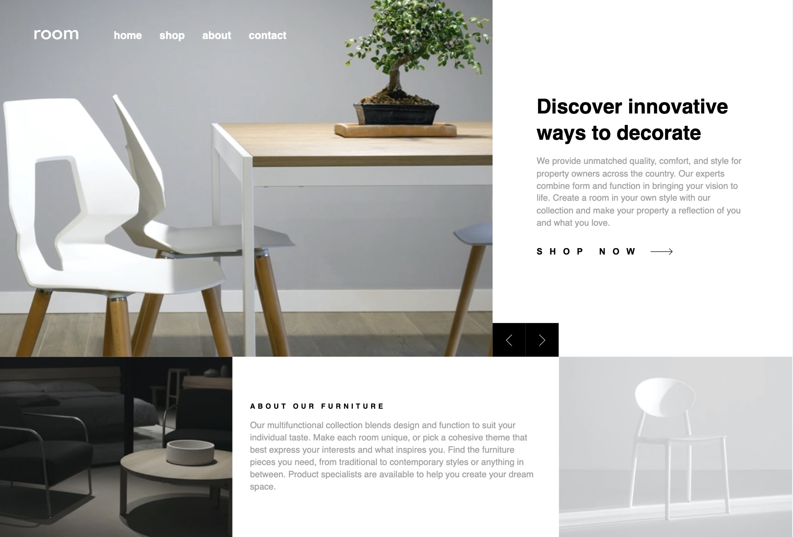
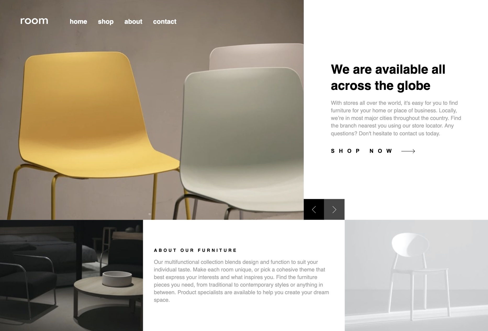

# Frontend Mentor - Room homepage solution

This is a solution to the [Room homepage challenge on Frontend Mentor](https://www.frontendmentor.io/challenges/room-homepage-BtdBY_ENq). Frontend Mentor challenges help you improve your coding skills by building realistic projects. 

## Table of contents

- [Overview](#overview)
  - [The challenge](#the-challenge)
  - [Screenshot](#screenshot)
  - [Links](#links)
- [My process](#my-process)
  - [Built with](#built-with)
  - [What I learned](#what-i-learned)
  - [Continued development](#continued-development)
  - [Useful resources](#useful-resources)

## Overview

### The challenge

Users should be able to:

- View the optimal layout for the site depending on their device's screen size
- See hover states for all interactive elements on the page
- Navigate the slider using either their mouse/trackpad or keyboard

### Screenshot




### Links

- Solution URL: [Add solution URL here](https://your-solution-url.com)
- Live Site URL: [Add live site URL here](https://your-live-site-url.com)

## My process

### Built with

- Semantic HTML5 markup
- CSS custom properties
- Flexbox
- CSS Grid
- Mobile-first workflow
- Sass

### What I learned

This time, I learned how to implement a slider indicator that moves along with the images and descriptions. I isolated the arrows so the index can serve as the single source.

```html
<div class="slide-contents">
  <!-- Slide 1 -->
  <div class="slide-content">
    ...
  </div>
  ...
</div>
<!-- Slide Arrays -->
<div class="slide-arrays">
  <button aria-label="Previous slide" id="previous-btn" class="slide-arrays-button" aria-disabled="true">
    
  </button>
  <button aria-label="Next slide" id="next-btn" class="slide-arrays-button">
    
  </button>
</div>
```

```js
let currentSlide = 0;
const totalSlidesLength = totalSlides.length;

function showSlide() {
  slideContents.style.transform = `translateX(-${currentSlide * 100}%)`;
  prevBtn.setAttribute("aria-disabled", currentSlide === 0);
  nextBtn.setAttribute("aria-disabled", currentSlide === totalSlidesLength - 1);
}
prevBtn.addEventListener("click", () => {
  if (currentSlide > 0) {
    currentSlide--;
    showSlide();
  }
});
nextBtn.addEventListener("click", () => {
  if (currentSlide < totalSlidesLength - 1) {
    currentSlide++;
    showSlide();
  }
});
```

### Continued development

I was unsure about styling the layout by adjusting with rems. I'll keep learning how to apply dynamic styling effectively.

### Useful resources

- [CSS Tricks](https://css-tricks.com/snippets/sass/mixin-manage-breakpoints/) - This time, I used Sass and experimented with mixins for media queries. I referred to this website for guidance on how to implement them."
# room-homepage-master
